# 📋 E-Signed System - Tổng Quan Kiến Trúc & Module Chức Năng

## 1. Sơ Đồ Kiến Trúc Tổng Quan Hệ Thống

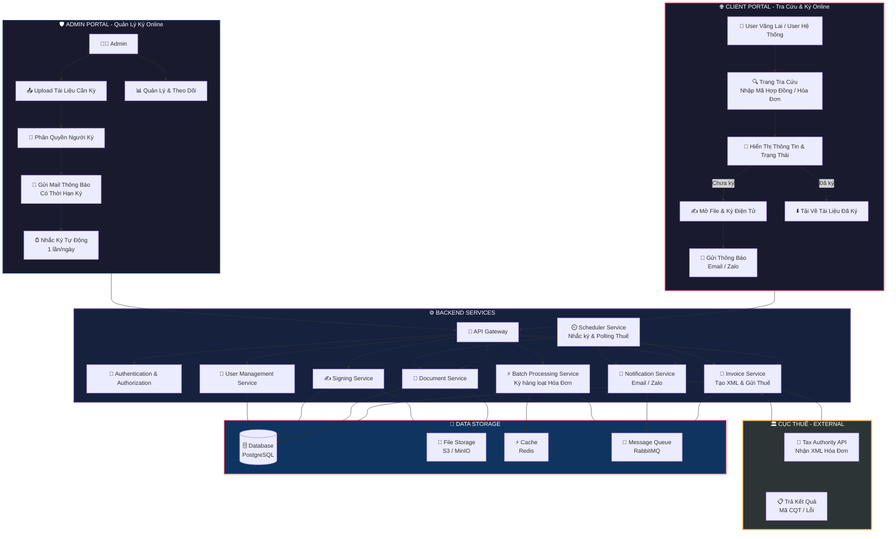

---

## 2. Luồng Xử Lý Chi Tiết - Client Portal

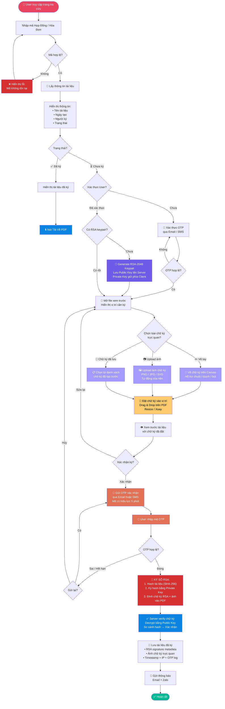

---

## 3. Luồng Quản Lý Tài Liệu - Ký File PDF (Admin)

> [!IMPORTANT]
> **Luồng này dành cho TÀI LIỆU (Hợp đồng, Phụ lục, Biên bản…)** — Admin upload file PDF có sẵn → chỉ định người ký → theo dõi đến khi ký xong. Hoàn toàn **tách biệt** với luồng Hóa đơn điện tử.

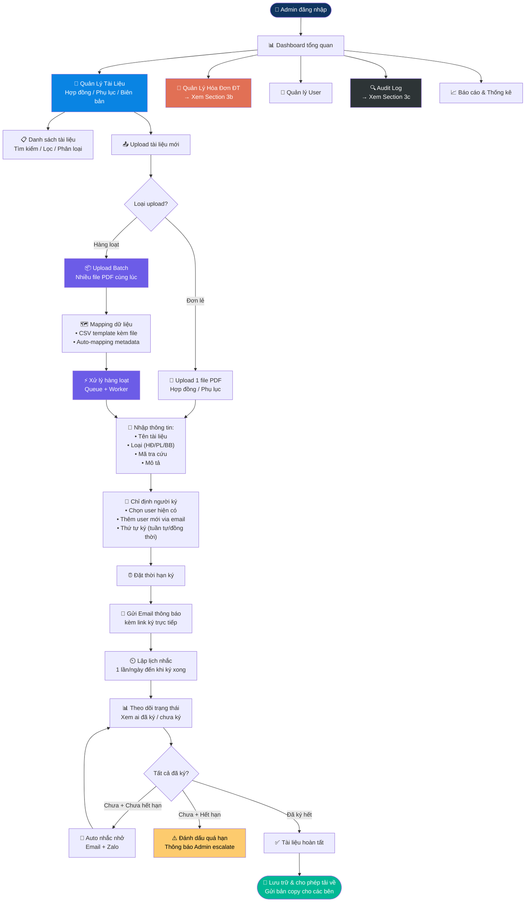

---

## 3b. Luồng Quản Lý Hóa Đơn Điện Tử (Admin)

> [!IMPORTANT]
> **Luồng này dành cho HÓA ĐƠN ĐIỆN TỬ** — User/Admin nhập thông tin các field theo quy định Cục Thuế → hệ thống tạo XML → đẩy lên thuế → nhận mã CQT. **Không phải** upload file PDF có sẵn.

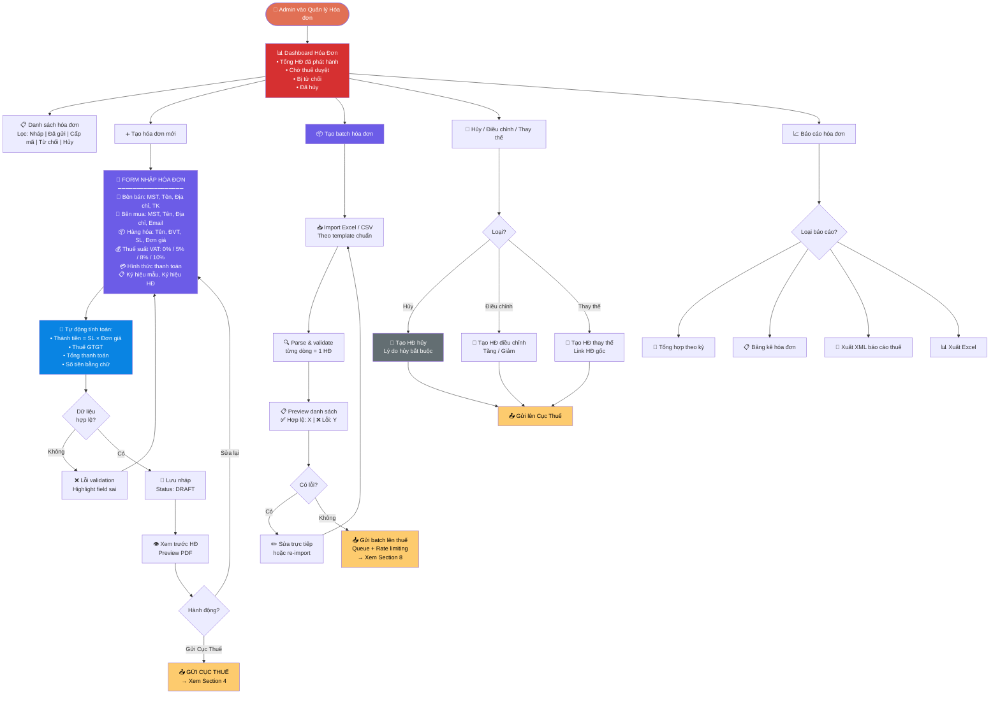

---

## 4. Luồng Kỹ Thuật: Tạo XML & Gửi Cục Thuế (Chi Tiết)

> [!NOTE]
> Đây là luồng kỹ thuật phía backend khi hóa đơn được xác nhận gửi từ Section 3b. Áp dụng cho cả tạo đơn lẻ và batch.

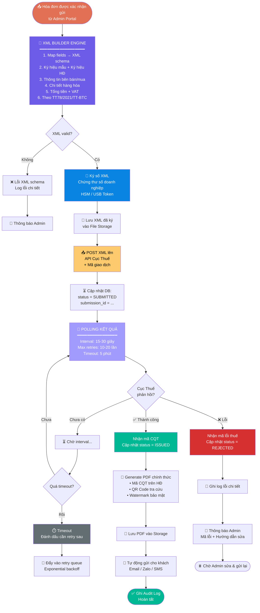

> [!NOTE]
> **Cấu trúc XML theo Cục Thuế (TT78/2021/TT-BTC):**
> - **Header**: Ký hiệu mẫu, ký hiệu hóa đơn, số hóa đơn
> - **Seller**: MST, tên, địa chỉ, số tài khoản
> - **Buyer**: MST, tên, địa chỉ, email
> - **Items**: Tên hàng hóa/dịch vụ, đơn vị tính, số lượng, đơn giá, thành tiền
> - **Summary**: Tổng tiền trước thuế, thuế GTGT, tổng thanh toán
> - **Digital Signature**: Chữ ký số của doanh nghiệp

---

## 4b. Luồng Kỹ Thuật: Chữ Ký Số RSA (Chi Tiết)

> [!IMPORTANT]
> Chữ ký user sử dụng **mã hóa bất đối xứng RSA** để đảm bảo tính toàn vẹn, xác thực và chống chối bỏ. Mỗi user có 1 cặp khóa RSA riêng.

```mermaid
flowchart TD
    subgraph KEYGEN["🔑 ĐĂNG KÝ CẶP KHÓA RSA - Lần đầu ký"]
        direction TB
        U_FIRST(["👤 User lần đầu ký"]) --> GEN["🔧 Generate RSA-2048 Keypair<br/>━━━━━━━━━━━━━━━━━━<br/>📗 Public Key: 2048-bit<br/>📕 Private Key: 2048-bit"]
        GEN --> STORE_PUB["📤 Gửi Public Key lên Server<br/>Lưu vào DB gắn với User ID"]
        GEN --> STORE_PRIV["💾 Private Key lưu phía Client<br/>• Browser: IndexedDB encrypted<br/>• Mobile: Secure Keychain<br/>• Bảo vệ bằng PIN/Biometric"]
    end

    subgraph SIGNING["✍️ QUY TRÌNH KÝ TÀI LIỆU"]
        direction TB
        DOC_READY(["📄 Tài liệu sẵn sàng ký"]) --> HASH["#️⃣ HASH TÀI LIỆU<br/>━━━━━━━━━━━━━━━━━━<br/>Algorithm: SHA-256<br/>Input: Nội dung PDF binary<br/>Output: 256-bit hash digest"]
        HASH --> ENCRYPT["🔐 KÝ SỐ RSA<br/>━━━━━━━━━━━━━━━━━━<br/>Input: Hash digest<br/>Key: Private Key (client-side)<br/>Algorithm: RSA-PKCS1-v1.5<br/>Output: Digital Signature (256 bytes)"]
        ENCRYPT --> EMBED["📎 ĐÍNH CHỮ KÝ VÀO PDF<br/>━━━━━━━━━━━━━━━━━━<br/>• RSA Signature bytes<br/>• Timestamp ký (ISO 8601)<br/>• Signer ID & metadata<br/>• Certificate chain"]
        EMBED --> SEND_SIG["📤 Gửi lên Server:<br/>• Signed PDF<br/>• RSA Signature<br/>• Document Hash<br/>• Timestamp"]
    end

    subgraph VERIFY["✅ XÁC THỰC CHỮ KÝ (Server-side)"]
        direction TB
        RECV(["📥 Server nhận chữ ký"]) --> GET_PUB["🔑 Lấy Public Key<br/>của User từ DB"]
        GET_PUB --> DECRYPT["🔓 GIẢI MÃ RSA<br/>━━━━━━━━━━━━━━━━━━<br/>Input: Digital Signature<br/>Key: Public Key (server)<br/>Output: Decrypted Hash"]
        DECRYPT --> REHASH["#️⃣ Hash lại tài liệu<br/>SHA-256 từ PDF gốc"]
        REHASH --> COMPARE{"So sánh hash?"}
        COMPARE -->|"✅ Khớp"| VALID["✅ Chữ ký HỢP LỆ<br/>• Tài liệu chưa bị sửa đổi<br/>• Xác nhận đúng người ký<br/>• Chống chối bỏ"]
        COMPARE -->|"❌ Không khớp"| INVALID["❌ Chữ ký KHÔNG HỢP LỆ<br/>• Tài liệu bị thay đổi<br/>• Hoặc chữ ký giả mạo"]
        VALID --> SAVE_DB["💾 Lưu vào DB:<br/>• rsa_signature<br/>• document_hash<br/>• signed_at + IP"]
    end

    KEYGEN --> SIGNING
    SIGNING --> VERIFY

    style U_FIRST fill:#6c5ce7,color:#fff
    style GEN fill:#0984e3,color:#fff
    style DOC_READY fill:#e17055,color:#fff
    style HASH fill:#a29bfe,color:#fff
    style ENCRYPT fill:#d63031,color:#fff
    style EMBED fill:#fdcb6e,color:#000
    style RECV fill:#e17055,color:#fff
    style DECRYPT fill:#00b894,color:#fff
    style VALID fill:#00b894,color:#fff
    style INVALID fill:#d63031,color:#fff
    style KEYGEN fill:#1a1a2e,stroke:#6c5ce7,stroke-width:2px,color:#fff
    style SIGNING fill:#1a1a2e,stroke:#e17055,stroke-width:2px,color:#fff
    style VERIFY fill:#1a1a2e,stroke:#00b894,stroke-width:2px,color:#fff
```

> [!NOTE]
> **Thông số kỹ thuật RSA:**
>
> | Thành phần | Giá trị |
> |---|---|
> | Key Size | RSA-2048 (hoặc RSA-4096 cho bảo mật cao) |
> | Hash Algorithm | SHA-256 |
> | Padding Scheme | PKCS#1 v1.5 hoặc PSS |
> | Signature Size | 256 bytes (RSA-2048) |
> | Private Key Storage | Client-side (IndexedDB encrypted / Secure Keychain) |
> | Public Key Storage | Server-side (DB gắn với User ID) |
> | Encoding | Base64 cho truyền tải, DER/PEM cho lưu trữ |

> [!WARNING]
> **Bảo mật Private Key:**
> - Private Key **KHÔNG BAO GIỜ** được gửi lên server
> - Mã hóa Private Key bằng AES-256 trước khi lưu IndexedDB
> - Yêu cầu PIN/Biometric mỗi lần sử dụng Private Key để ký
> - Hỗ trợ backup/restore keypair qua mã QR encrypted
> - Khi user mất key → Revoke cặp khóa cũ, generate keypair mới

---

## 3c. Luồng Quản Lý Audit Log (Admin)

> [!NOTE]
> Audit Log ghi nhận **mọi hành động** trên hệ thống để đảm bảo truy vết, tuân thủ pháp lý và phát hiện bất thường bảo mật.

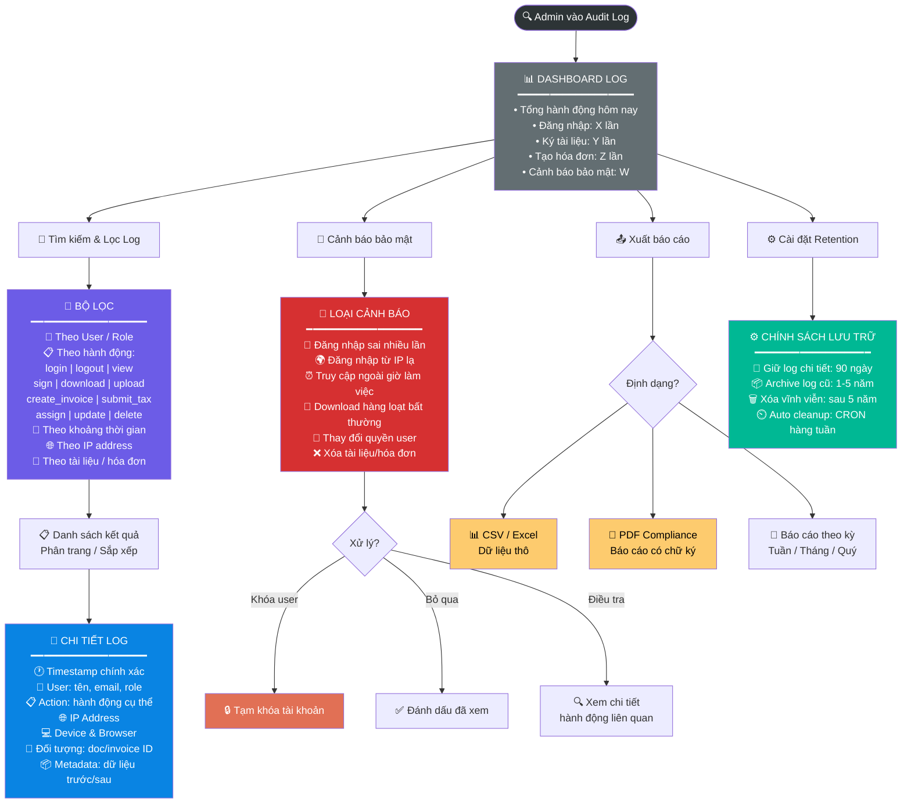

---

## 5. Scheduler - Luồng Nhắc Ký Tự Động

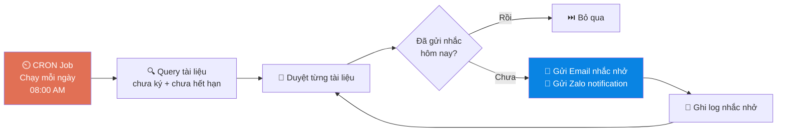

---

## 6. Tổng Quan Module Chức Năng

### 🌐 Module Client Portal

| # | Module | Chức năng chính | Ghi chú |
|---|--------|----------------|---------|
| 1 | **Tra cứu tài liệu** | Nhập mã hợp đồng/hóa đơn → hiển thị thông tin & trạng thái | Public, không cần đăng nhập |
| 2 | **Xem trước tài liệu** | Render PDF trên trình duyệt, hiển thị vị trí cần ký | PDF Viewer (pdf.js) |
| 3 | **Tạo chữ ký trực quan** | Vẽ tay trên Canvas (chuột/touch/bút) / Upload ảnh chữ ký (PNG/JPG) / Chọn chữ ký đã lưu | Canvas + Image processing |
| 4 | **Đặt chữ ký vào tài liệu** | Drag & Drop chữ ký vào vị trí trên PDF, resize, xoay | Interactive PDF overlay |
| 5 | **Ký số RSA** | Hash SHA-256 → Ký bằng Private Key RSA-2048 → Đính chữ ký số + ảnh vào PDF | RSA asymmetric signing |
| 6 | **Quản lý RSA Keypair** | Generate keypair lần đầu, lưu Private Key phía client (encrypted), Public Key trên server | RSA-2048 / RSA-4096 |
| 7 | **Xác thực người ký** | OTP qua Email/SMS trước khi ký | Bảo mật chống giả mạo |
| 8 | **Tải tài liệu** | Download PDF đã ký hoàn chỉnh, verify chữ ký RSA | Watermark + Timestamp |

---

### 🛡️ Module Admin Portal

| # | Module | Chức năng chính | Ghi chú |
|---|--------|----------------|---------|
| 1 | **Dashboard** | Tổng quan: số tài liệu chờ ký, đã ký, quá hạn, thống kê | Real-time widgets |
| 2 | **Quản lý tài liệu** | CRUD tài liệu, phân loại (Hợp đồng/Hóa đơn), tìm kiếm, lọc | Full-text search |
| 3 | **Upload & Batch Upload** | Upload đơn lẻ hoặc hàng loạt (CSV + ZIP), mapping dữ liệu tự động | Tối ưu cho hóa đơn số lượng lớn |
| 4 | **Phân quyền ký** | Chỉ định người ký cho từng tài liệu, luồng ký tuần tự/đồng thời | Workflow engine |
| 5 | **Quản lý User** | CRUD user, phân role (Admin/Manager/Signer), import user hàng loạt | RBAC |
| 6 | **Thông báo & Nhắc nhở** | Gửi mail thông báo, lập lịch nhắc hàng ngày, quản lý template email | Scheduler + Queue |
| 7 | **Báo cáo & Thống kê** | Thống kê theo thời gian, xuất báo cáo Excel/PDF | Charts & Export |
| 8 | **Quản lý thời hạn** | Đặt deadline, cảnh báo sắp hết hạn, đánh dấu quá hạn | Auto-escalation |
| 9 | **Audit Log** | Ghi nhận mọi hành động: ai ký, lúc nào, IP, thiết bị | Compliance & Traceability |
| 10 | **Quản lý Audit Log** | Dashboard log, tìm kiếm/lọc, cảnh báo bảo mật, xuất báo cáo, retention policy | Admin only |

---

### ✍️ Module Ký Văn Bản & Hợp Đồng Điện Tử

| # | Module | Chức năng chính | Ghi chú |
|---|--------|----------------|---------|
| 1 | **Tạo chữ ký** | Vẽ tay trên Canvas (chuột/touch/stylus) hoặc upload ảnh chữ ký (PNG/JPG/SVG), tự động xóa nền trắng | Canvas API + Image processing |
| 2 | **Quản lý chữ ký** | Lưu nhiều chữ ký mẫu, đặt mặc định, xóa, đổi tên. Mỗi user có thể có nhiều mẫu chữ ký | Gallery chữ ký cá nhân |
| 3 | **Vị trí ký trên tài liệu** | Drag & drop đặt chữ ký vào PDF, resize/xoay, preview trước khi ký, hỗ trợ nhiều vị trí ký | Interactive PDF overlay |
| 4 | **Workflow ký** | Ký tuần tự (lần lượt) hoặc đồng thời (song song), quy định thứ tự ký bắt buộc | Workflow engine |
| 5 | **Xác thực trước ký** | OTP Email/SMS, xác nhận PIN/Biometric trước mỗi lần ký | Multi-factor |
| 6 | **Ký số RSA** | Hash tài liệu SHA-256 → Ký bằng Private Key RSA → Embed chữ ký trực quan + chữ ký số vào PDF | RSA-2048 / Web Crypto API |
| 7 | **Xác minh chữ ký** | Verify chữ ký RSA bằng Public Key, kiểm tra tính toàn vẹn tài liệu, hiển thị trạng thái hợp lệ | Server-side verify |
| 8 | **Lưu trữ & chứng thực** | Lưu PDF đã ký + metadata (IP, device, timestamp, certificate chain), hỗ trợ tải về | Compliance & Traceability |

> [!TIP]
> **Chữ ký kết hợp 2 lớp:**
> - **Lớp trực quan** — Ảnh chữ ký tay / upload (hiển thị trên PDF cho dễ nhận biết)
> - **Lớp bảo mật** — Chữ ký số RSA mã hóa (đảm bảo tính pháp lý, toàn vẹn, chống chối bỏ)
> - Cả 2 lớp được embed đồng thời vào PDF khi ký

---

### 🧾 Module Quản Lý Hóa Đơn Điện Tử (E-Invoice)

| # | Module | Chức năng chính | Ghi chú |
|---|--------|----------------|---------|
| 1 | **Tạo hóa đơn** | Form nhập fields cơ bản theo quy định Cục Thuế: MST, tên bên bán/mua, hàng hóa, thuế suất, tổng tiền | Validate theo TT78 |
| 2 | **Tạo XML thuế** | Tự động generate XML theo cấu trúc chuẩn của Cục Thuế từ dữ liệu nhập | XML builder engine |
| 3 | **Ký số XML** | Ký chứng thư số doanh nghiệp lên XML trước khi gửi | HSM / USB Token |
| 4 | **Gửi & nhận kết quả thuế** | Push XML lên API Cục Thuế → Polling 1-2 phút → Nhận mã CQT hoặc mã lỗi | Async + Retry |
| 5 | **Quản lý hóa đơn** | Danh sách, tìm kiếm, lọc theo trạng thái (Nháp / Đã gửi / Cấp mã / Từ chối / Đã hủy) | CRUD + Filters |
| 6 | **Batch tạo hóa đơn** | Import Excel/CSV → Tạo hàng loạt hóa đơn → Gửi thuế batch | Queue + Worker Pool |
| 7 | **Hủy / Điều chỉnh / Thay thế** | Tạo hóa đơn hủy, điều chỉnh tăng/giảm, thay thế theo quy định | Theo NĐ123 |
| 8 | **Gửi hóa đơn cho khách** | Gửi PDF hóa đơn chính thức qua Email / Zalo / SMS cho người mua | Auto sau khi có mã CQT |
| 9 | **Báo cáo hóa đơn** | Tổng hợp theo kỳ, bảng kê hóa đơn, xuất XML báo cáo thuế | Export Excel/XML |

---

### ⚙️ Module Backend Services

| # | Service | Chức năng | Tech gợi ý |
|---|---------|-----------|-------------|
| 1 | **API Gateway** | Routing, rate limiting, load balancing | Nginx / Kong |
| 2 | **Auth Service** | JWT, OAuth2, OTP, RBAC | Keycloak / Custom |
| 3 | **Document Service** | Upload, lưu trữ, render PDF, quản lý metadata | pdf-lib, sharp |
| 4 | **Signing Service** | RSA keypair, hash SHA-256, ký/verify RSA, xử lý ảnh chữ ký (vẽ tay/upload), embed vào PDF | node-forge, pdf-lib, Web Crypto API, sharp |
| 5 | **Invoice Service** | Tạo XML thuế, ký số XML, gửi/nhận kết quả Cục Thuế, quản lý hóa đơn | xml2js, node-forge, axios |
| 6 | **Notification Service** | Gửi Email (SMTP), Zalo OA API, push notification | Nodemailer, Zalo OA SDK |
| 7 | **Batch Processing** | Xử lý hàng loạt hóa đơn + ký, queue-based async processing | Bull/BullMQ + Redis |
| 8 | **Scheduler Service** | CRON nhắc ký, kiểm tra deadline, polling kết quả thuế | node-cron / Agenda |
| 9 | **User Service** | CRUD user, quản lý profile, phân quyền | Custom |
| 10 | **Audit Service** | Ghi log hành động, truy vết | Elasticsearch (optional) |

---

### 💾 Module Data & Storage

| # | Component | Mục đích | Tech gợi ý |
|---|-----------|----------|-------------|
| 1 | **Database** | Lưu metadata tài liệu, user, lịch sử ký | PostgreSQL |
| 2 | **File Storage** | Lưu file PDF gốc & đã ký | MinIO / AWS S3 |
| 3 | **Cache** | Cache tra cứu, session, rate limiting | Redis |
| 4 | **Message Queue** | Async processing cho batch & notification | RabbitMQ / Redis Stream |

---

## 7. Batch Processing - Tối Ưu Cho Hóa Đơn Số Lượng Lớn

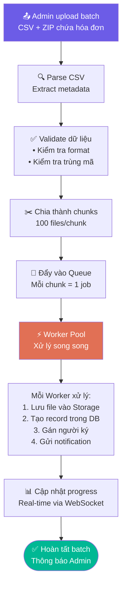

> [!TIP]
> **Chiến lược tối ưu Batch Processing:**
> - Chia nhỏ batch thành chunks (100 files/chunk) để xử lý song song
> - Sử dụng Worker Pool với số lượng worker có thể scale
> - Bulk insert vào DB thay vì insert từng record
> - Hiển thị progress real-time qua WebSocket
> - Retry mechanism cho các job thất bại

---

## 8. Batch Hóa Đơn Điện Tử - Gửi Thuế Hàng Loạt

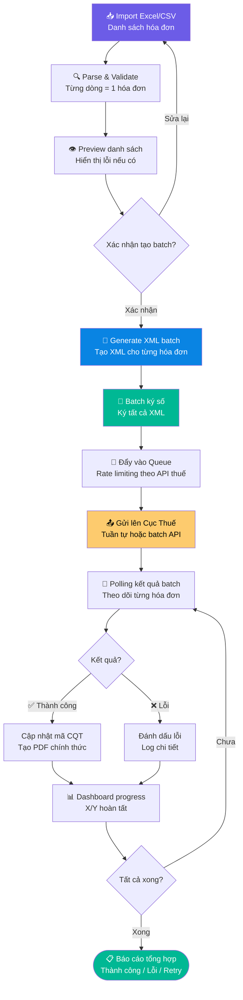

> [!WARNING]
> **Lưu ý khi gửi thuế hàng loạt:**
> - API Cục Thuế có **rate limit**, cần tuân thủ giới hạn số request/phút
> - Mỗi hóa đơn cần **polling riêng** để nhận kết quả (1-2 phút/hóa đơn)
> - Cần cơ chế **retry với exponential backoff** cho các trường hợp timeout
> - Nên gửi theo batch nhỏ (50-100 hóa đơn) và chờ kết quả trước khi gửi batch tiếp

---

## 9. Database Schema Tổng Quan (ERD)

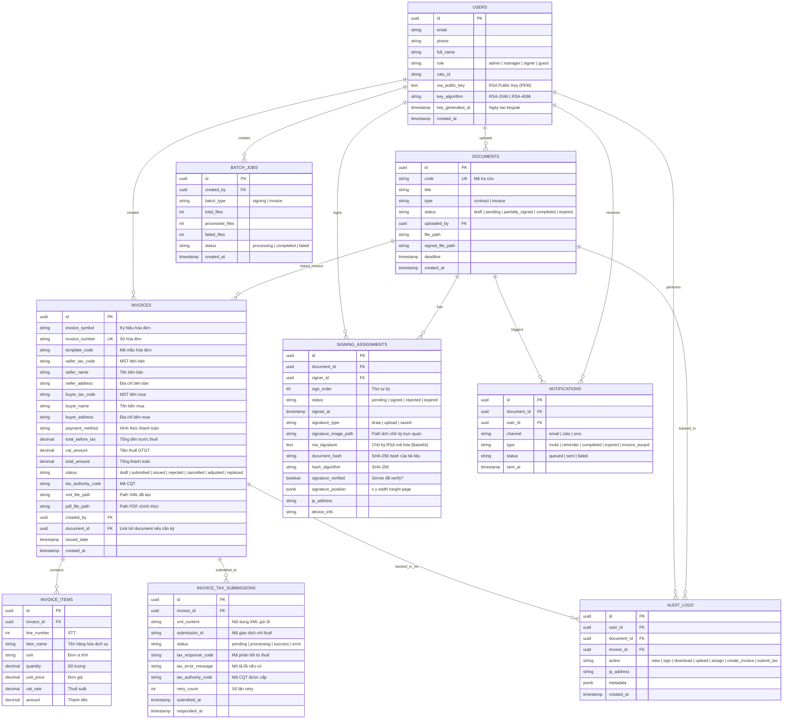

---

## 10. Tóm Tắt Tổng Quan

| Hệ thống | Số Module | Mục đích chính |
|-----------|-----------|----------------|
| **Client Portal** | 8 modules | Tra cứu, xem, tạo chữ ký, ký RSA, tải tài liệu |
| **Ký Văn Bản & HĐ ĐT** | 8 modules | Tạo/quản lý chữ ký, workflow ký, verify, lưu trữ |
| **Admin Portal** | 10 modules | Quản lý toàn bộ quy trình ký + audit log |
| **E-Invoice (Hóa đơn ĐT)** | 9 modules | Tạo, quản lý, gửi thuế hóa đơn điện tử |
| **Backend Services** | 10 services | Xử lý logic nghiệp vụ |
| **Data & Storage** | 4 components | Lưu trữ & caching |
| **External Integration** | 1 system | Tích hợp API Cục Thuế |
| **Tổng cộng** | **50 thành phần** | Hệ thống E-Signed hoàn chỉnh |

> [!IMPORTANT]
> **Ưu tiên phát triển gợi ý:**
> 1. **Phase 1** — Auth + Signing Service + Client Portal (tạo chữ ký + ký RSA đơn lẻ)
> 2. **Phase 2** — Admin Portal + User Management + Workflow ký + Notification
> 3. **Phase 3** — Invoice Service + Tạo XML + Tích hợp API Cục Thuế
> 4. **Phase 4** — Batch Processing (ký + hóa đơn) + Scheduler
> 5. **Phase 5** — Audit Log + Reports + Tối ưu hiệu suất
